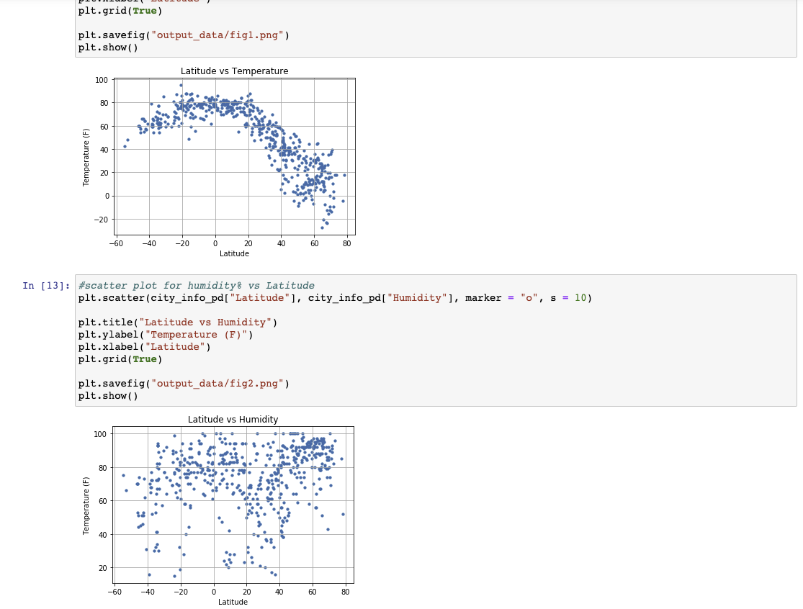
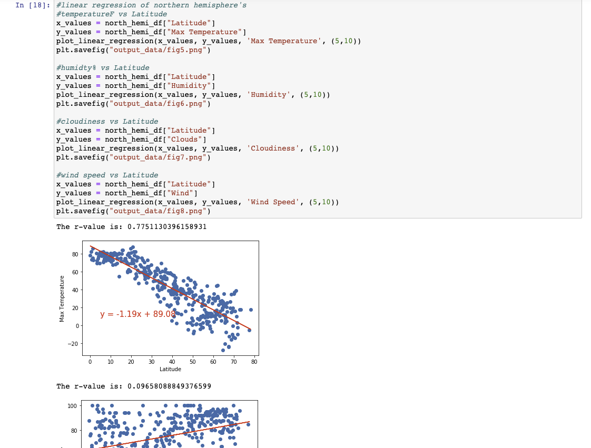
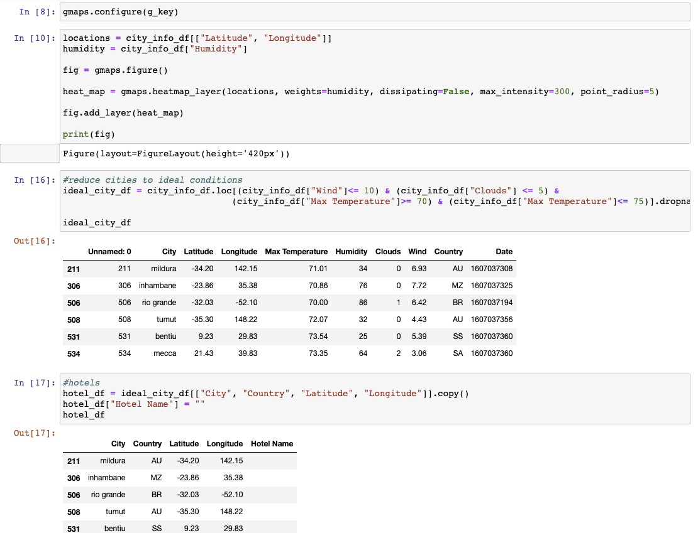

## What's the Weather Like?

## Background

Whether financial, political, or social -- data's true power lies in its ability to answer questions definitively. So let's take what you've learned about Python requests, APIs, and JSON traversals to answer a fundamental question: "What's the weather like as we approach the equator?"

Now, we know what you may be thinking: _"Duh. It gets hotter..."_

But, if pressed, how would you **prove** it?

## WeatherPy

Here is a Python script to visualize the weather of 500+ cities across the world of varying distance from the equator.

A series of scatter plots was created to showcase the following relationships:

* Temperature (F) vs. Latitude
* Humidity (%) vs. Latitude
* Cloudiness (%) vs. Latitude
* Wind Speed (mph) vs. Latitude

Next, a linear regression on each relationship was created, seperating into Northern and Southern hemispheres:

* Northern Hemisphere - Temperature (F) vs. Latitude
* Southern Hemisphere - Temperature (F) vs. Latitude
* Northern Hemisphere - Humidity (%) vs. Latitude
* Southern Hemisphere - Humidity (%) vs. Latitude
* Northern Hemisphere - Cloudiness (%) vs. Latitude
* Southern Hemisphere - Cloudiness (%) vs. Latitude
* Northern Hemisphere - Wind Speed (mph) vs. Latitude
* Southern Hemisphere - Wind Speed (mph) vs. Latitude

## VacationPy

With the weather data retrieved from the WeatherPy, now we create a Python script to plan future vacations based on our 
ideal temperature conditions with a heat map.

* Create a heat map that displays the humidity for every city from the WeatherPy

* Narrowed down the DataFrame to find our ideal weather condition. 

* Using Google Places API to find the first hotel for each city located within 5000 meters of coordinates.

